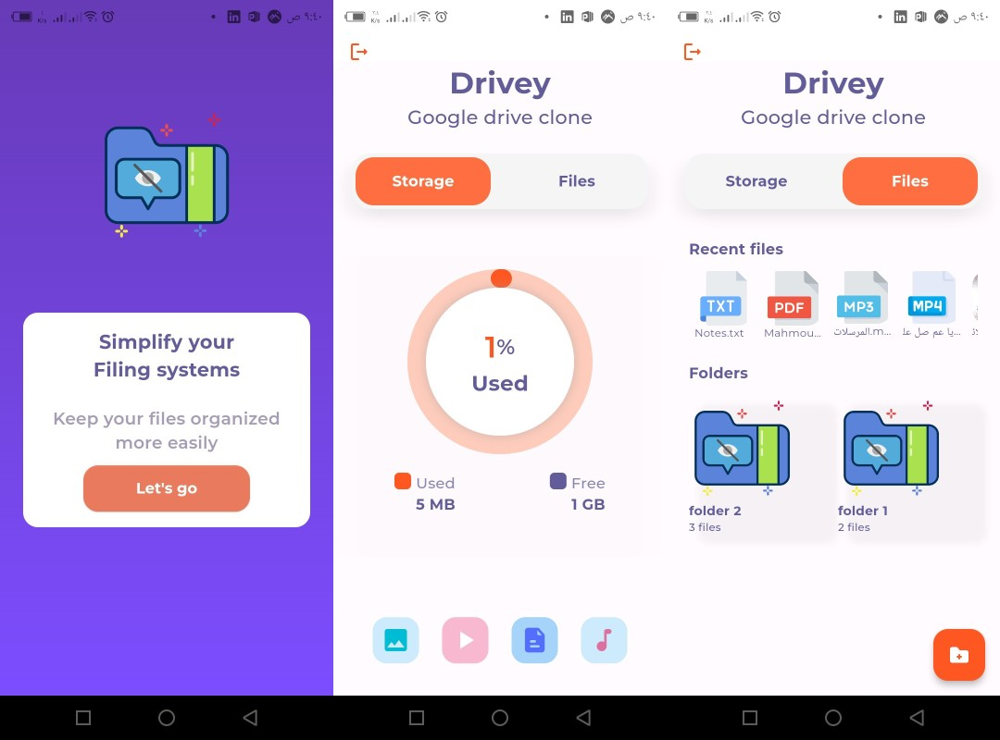
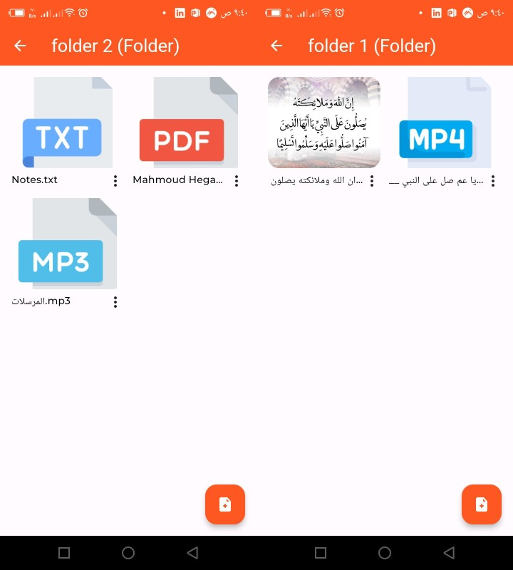
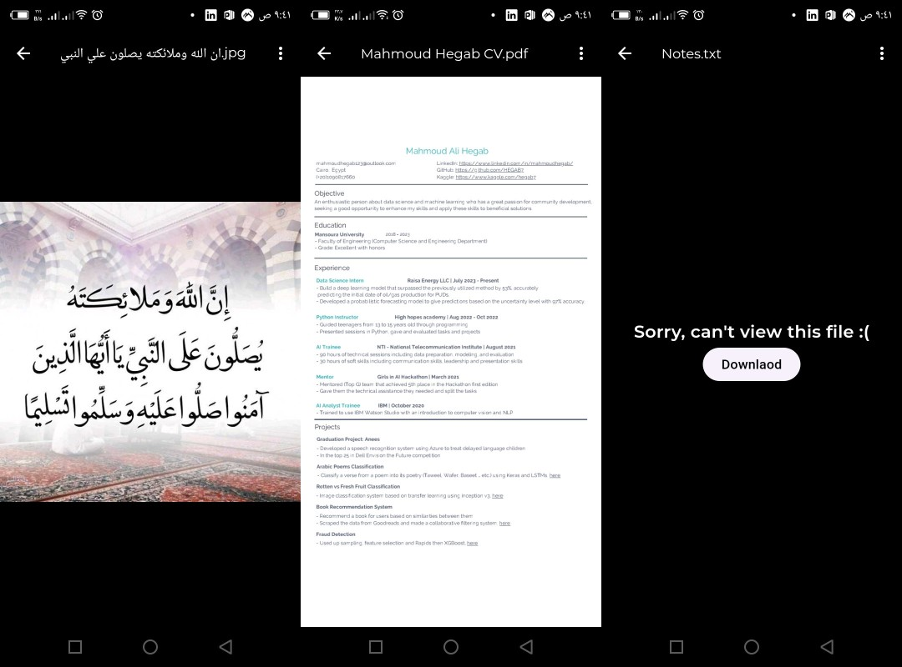
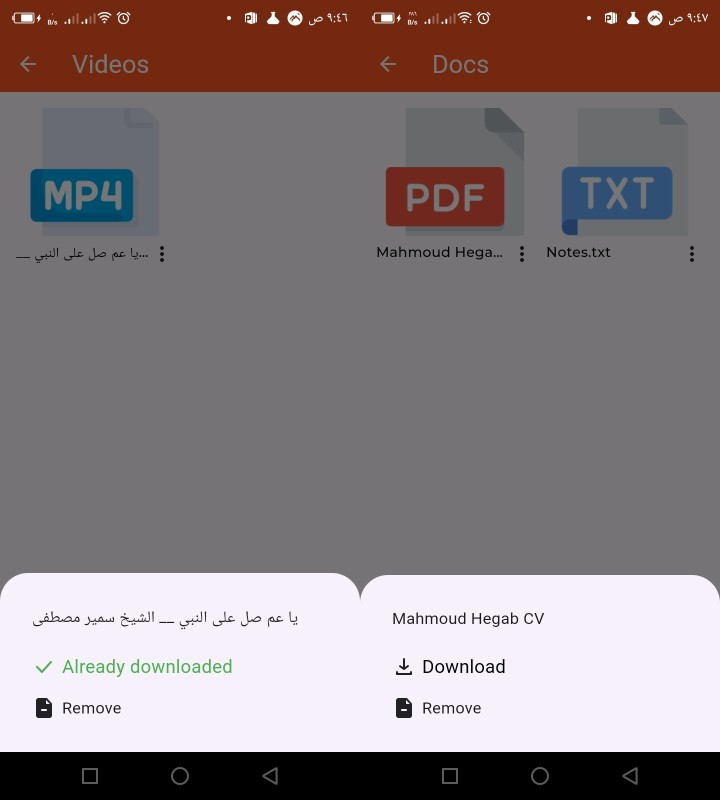

# Drivey Files
A google drive clone built with Flutter, Firebase for backend, Getx for state mangement and MVC architicutre.

## Tools
- Firebase auth for authentication
- Firestore for storing metadata of the user, files and folders
- Firestorage for actually storing the files
- Filepicker for picking the files
- Getx for state management
- mime for determining the file type and extenstion
- video_compress & flutter_image_compress for compressing videos and images
- flutter_pdfview for pdf viewing
- http and dio for downlaoading files and getting pdf files as list of bytes so the flutter_pdfview package can show it
- cached_network_image for caching images
- rexdart for compining streams from audio file using just_audio package 
- video_player for initilizing the video controller and chewie package for actully playing the video from video controller
- path provider for providing different paths for both Android and IOS
- ......

## Screen shots

!

!

!
